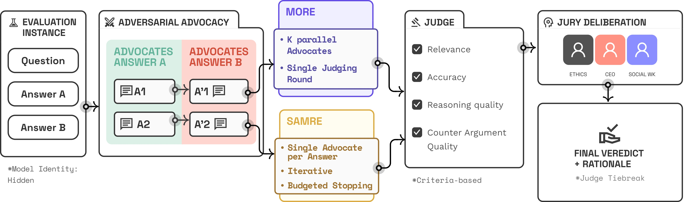

# LLM-Based-Judging-Architectures

<p align="center">
  
</p>

## Overview

LLM evaluation faces a fundamental challenge: while human assessment remains the gold standard, it is prohibitively expensive and slow. Single-judge LLM evaluation scales but suffers from well-documented biases—positional bias, verbosity bias, and self-enhancement—that compromise reliability. Existing multi-agent approaches add complexity without principled cost-awareness or theoretical grounding.

D3 addresses this gap through a **courtroom-inspired multi-agent framework** where role-specialized agents (advocates, judge, jury) engage in structured adversarial debate to produce reliable, interpretable, and cost-efficient evaluations. The framework combines three key innovations:

1. **Structured debate protocols**: Dual evaluation modes (MORE for efficiency, SAMRE for depth) with explicit cost-accuracy trade-offs
2. **Theoretical grounding**: Probabilistic convergence guarantees and formal justification for multi-advocate signal amplification
3. **Budgeted stopping**: Automated debate termination based on convergence criteria, reducing token consumption by 40% without sacrificing accuracy

Validated across MT-Bench, AlignBench, and AUTO-J, D3 achieves 86.3% accuracy—a 12.6% absolute improvement over single-judge evaluation and 6.9% over the best existing framework—while providing full interpretability through debate transcripts and reasoned jury verdicts.


```
## Installation and Setup

Our agentic architecture is built on **MetaGPT**, a framework designed to efficiently manage interactions between agents using shared memory.

To use the MetaGPT framework, follow these steps:

1. **Clone the Repository**
   
First, clone the repository and navigate to the relevant directory:
```bash
git clone https://github.com/abirharrasse/LLM-Judging-Architectures  && cd LLM-Judging-Architectures/MetaGPT_LLM_advocates
```
3. **Install Dependencies**
   
Install the necessary packages:
```bash
pip install --upgrade -e .
pip install together -q
```
3. Initialize Configuration

Set up the configuration file for the MetaGPT framework:
```bash
metagpt --init-config
```
Before running this command, ensure you're in the correct directory:
```bash
import os
os.chdir('/content/LLM-Judging-Architectures/MetaGPT_LLM_advocates')
print(os.getcwd())
```
4. Set API Keys
   
Set the required API keys to run your experiments:
```bash
os.environ['OPENAI_API_KEY'] = 'sk-'
os.environ['TOGETHER_API_KEY'] = '' 
os.environ['CLAUDE_API_KEY'] = ''
os.environ['GEMINI_API_KEY'] = ''
os.environ['COHERE_API_KEY'] = ''
```

## Quick Start

```python
from utils.arch_builder import samre_arch, more_arch

# Run SAMRE evaluation
scores, jury_votes, stats = samre_arch(
    model="gpt-4o",
    temp=0.7,
    question="Which response is more helpful?",
    answer1="First answer...",
    answer2="Second answer...",
    investment=0.1,
    n_rounds=5,
    n_juries=5
)

# Run MORE evaluation
scores, jury_votes, stats = more_arch(
    model="gpt-4o",
    temperature=0.7,
    question="Which is better?",
    answer1="Answer A",
    answer2="Answer B",
    n_advocates=3,
    investment=0.1,
    n_rounds=1,
    n_juries=5
)
```

## Key Features

- **Budgeted Stopping**: 58% of debates converge by round 2 (mean 2.71 rounds)
- **Anonymization**: Jury receives anonymized transcripts to prevent bias
- **50 Personas**: Diverse jury pool across law, medicine, tech, ethics, etc.
- **Multi-Benchmark**: Support for MT-Bench, AlignBench, AUTO-J


## Project Structure

```
utils/
├── SAMRE_architecture.py   # Single-Advocate Multi-Round with budgeted stopping
├── MORE_architecture.py    # Multi-Advocate One-Round evaluation
├── arch_builder.py         # High-level protocol wrappers
├── convergence.py          # Budgeted stopping + convergence detection
├── token_tracker.py        # Cost/token tracking
├── anonymizer.py           # Transcript anonymization for jury
├── metrics.py              # Cohen's Kappa, positional swap, self-enhancement
├── personas.py             # 50-persona pool across 9 domains

data/
└── benchmark_loader.py             # MT-Bench/AlignBench/AUTO-J loaders
```


## Citation

```bibtex
@misc{bandi2025debatedeliberatedecided3,
      title={Debate, Deliberate, Decide (D3): A Cost-Aware Adversarial Framework for Reliable and Interpretable LLM Evaluation}, 
      author={Chaithanya Bandi and Abir Harrasse},
      year={2025},
      eprint={2410.04663},
      archivePrefix={arXiv},
      primaryClass={cs.CL},
      url={https://arxiv.org/abs/2410.04663}, 
}
```
